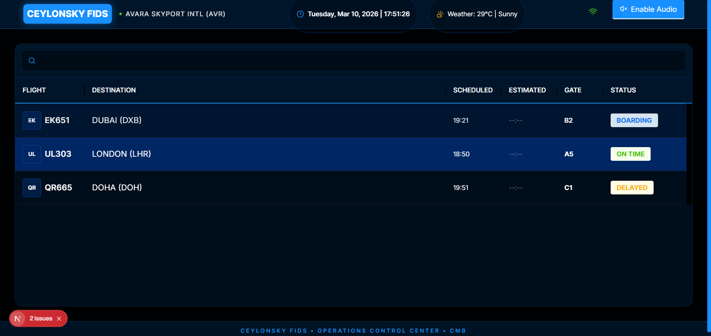

  
  
  
  
  
  
  
  

# 🧩 CeylonSky FIDS

> **Empowering Air Travel with Real-Time, Trilingual Flight Intelligence.**

CeylonSky FIDS is a **Modern Web Application** designed to **provide high-performance, localized, and resilient flight information display systems for international airports**.

The system focuses on **offline-first reliability and trilingual accessibility** and aims to **ensure every passenger is informed in real-time, regardless of network conditions**.

---

# ✨ Key Features

| Feature | Description |
|---|---|
| **Real-time Flight Tracking** | Dynamic dashboard with instant status updates for Departures and Arrivals. |
| **Multi-Language Cycling** | Automatically cycles through English, Sinhala, and Tamil for maximum accessibility. |
| **Offline-First Resilience** | Powered by PouchDB, ensuring the display is never blank during network drops. |
| **Fictional Data Isolation** | Built for "AVARA SKYPORT INTL", offering a clean, brand-isolated environment. |
| **Modern Dashboard UI** | Premium dark-themed interface designed for high-glare airport kiosks. |
| **Flexible DB Integration** | Decoupled architecture allowing seamless swapping between MongoDB, local DB and caching. |

---

# 🎬 Project Demonstration

The following resources demonstrate the system's behavior:

- [📹 Product Video](#-product-video)
- [📸 Screenshots of Key Features](#-screenshots)
- [📄 System Architecture Overview](#-architecture-overview)
- [🧠 Engineering Lessons](#-engineering-lessons)
- [🔧 Design Decisions](#-key-design-decisions)
- [🗺️ Roadmap](#-roadmap)
- [🚀 Future Improvements](#-future-improvements)
- [📄 Documentations](#-documentations)
- [📝 License](#-license)
- [📩 Contact](#-contact)

---

# 📹 Product Video

> **[DEMONSTRATION PENDING]**

*A comprehensive video or GIF of the system's walkthrough demonstrating the Architecture, engines, and core workflows is available soon!*

---

# 📸 Screenshots

### 🏙️ Main Dashboard View (AVARA SKYPORT INTL)

---

# ⚙️ Architecture Overview

CeylonSky FIDS is implemented using an **MVVM (Model-View-ViewModel)** architectural pattern.

### Frontend
- **Next.js 15+**: App Router for optimized performance and SEO.
- **Ant Design**: Professional-grade data visualization components.
- **Tailwind CSS**: Utility-first styling for a custom, cohesive design system.

### Backend
- **Next.js API Routes**: Edge-ready serverless backend logic.
- **Node.js**: Robust server-side environment.
- **MongoDB**: Flexible database synchronization layers.

### Local Persistence
- **PouchDB**: Local-first synchronization engine.
- **IndexedDB**: High-performance browser-based data storage.

---

# 🧠 Engineering Lessons

During development of CeylonSky FIDS, the focus areas included:

- **Reactive UI Design**: Implementing real-time dashboard updates without performance degradation.
- **State Synchronization**: Managing complex data flows between local PouchDB and the global Zustand store.
- **Trilingual Logic**: Designing a scalable React hook for automated UI language cycling.
- **Database Decoupling**: Building a persistence layer that is agnostic of the underlying database engine (MongoDB, local DB and caching).
- **Error Resiliency**: Handling Turbopack and build-time panics through strict dependency management.

---

# 🔧 Key Design Decisions

1. **Dark Mode for Kiosk Optimization**  
   The carbon-fibre theme was chosen to improve readability in high-brightness terminal environments and reduce eye strain.

2. **Offline-First Synchronization (PouchDB)**  
   To prevent blank screens during airport network interruptions, local persistence was prioritized over direct server calls.

3. **Zustand for State Logic**  
   Zustand was selected for its minimal footprint and efficient handling of high-frequency data changes compared to Redux.

4. **Trilingual Transition Engine**  
   Automatic cycling ensures that every passenger gets a turn to read information in their native language in a shared kiosk environment.

---

# 🗺️ Roadmap

Key upcoming features planned for CeylonSky FIDS:

- ✅ **DONE** - Trilingual Core Engine
- ✅ **DONE** - Responsive, realtime, efficient, modern, minimalistic & high-performance Dashboard and Fictional Branding
- 🚧 **IN PROGRESS** - MongoDB / API Integration Layer
- 🚧 **IN PROGRESS** - Advanced Flight Search and Filtering
- 📅 **NOT STARTED** - Administrative system for managing flights in this FIDS view system.

---

# 🚀 Future Improvements

Planned enhancements include:

- **Predictive Delay Engine**: Using historical data to forecast potential flight delays.
- **Enhanced Audio Engine**: Full local-language Text-to-Speech (TTS) announcements.
- **Mobile Terminal Buddy**: A companion app for individual passenger gate updates.
- **Interactive Terminal Map**: 3D gate navigation integrated into the Flight Details drawer.

---

## 📄 Documentations

Additional documentation is available in the `docs/` folder:

| File | Description |
|---|---|
| ["System Architecture"](docs/architecture.md) | Deep dive into the MVVM and data sync logic. |
| ["Key Features"](docs/features.md) | Detailed explanation of every system capability. |

---

## 📝 License

This repository is published for **portfolio and educational review purposes**.

The source code may not be accessed, copied, modified, distributed, or used without explicit permission from the author.

© 2026 Viraj Tharindu — All Rights Reserved.

---

# 📩 Contact

If you are reviewing this project as part of a hiring process or are interested in the technical approach behind it, feel free to reach out.

I would be happy to discuss the architecture, design decisions, or provide a private walkthrough of the project.

**Opportunities for collaboration or professional roles are always welcome.**

📧 [virajtharindu1997@gmail.com](mailto:virajtharindu1997@gmail.com)  
💼 [viraj-tharindu](https://www.linkedin.com/in/viraj-tharindu/)  
🐙 [VirajTharindu](https://github.com/VirajTharindu)  

---

  <em>Revolutionizing Passenger Information, One Airport at a Time.</em>

